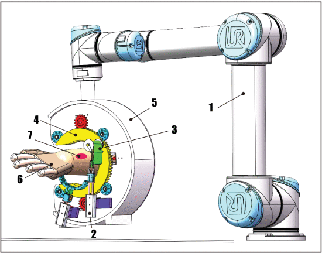
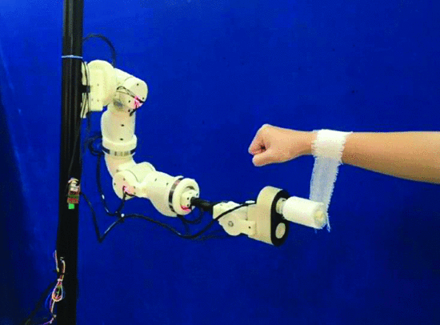

# Robot-assisted automated bandaging: A method that adapts to the body contour

Bandaging treated wounds with gauze bandages is a common task in nursing scenarios. It is a simple job for human nurses, but with the development of medical technology, automated bandaging is highly anticipated due to its standardization, stability and rationality.

---

At the time this text was recorded, automated wrapping was only being simply explored, and these tasks focused on the end mechanism or overall mechanism design of the robot to achieve wrapping operations.

>A. Chen et al., "Preliminary Design of Robotic System for Closing Incision by Rotating Bandage Method*," 2023 WRC Symposium on Advanced Robotics and Automation (WRC SARA), Beijing, China, 2023, pp. 115-120, doi: 10.1109/WRCSARA60131.2023.10261823.

The above picture shows the overall robot designed by Beijing University of Posts and Telecommunications (although it appears in the form of an end effector).

>J. Li et al., "A Method for a Compliant Robot Arm to Perform a Bandaging Task on a Swaying Arm: A Proposed Approach," in IEEE Robotics & Automation Magazine, vol. 30, no. 1, pp. 50-61, March 2023, doi: 10.1109/MRA.2022.3228501.

As shown in the above picture, the work is from Guangdong University of Technology. They designed a wheeled end effector and incorporated a force control algorithm to achieve bandaging.

---

## Thought

* Considering that many current robot-related studies emphasize universality, it interests me more that the bandaging task is performed by a universal robot end gripper than by a dedicated mechanism design.

* Although some works have modeled the deformation of gauze, consideration for the deformation of skin contact is still lacking. I think the dynamic shape of the bandaged object is very important, even though it is much smaller compared to the deformation of the gauze itself.

* In addition, the way of bandaging is highly related to the external shape of the bandaged object (the trunk). The spiral wrapping of the aforementioned work does not guarantee applicability to more positions; it is perfectly adapted to cylinders. Therefore, offline local scanning and pre-planning of bandaging trajectories are highly anticipated.

## What to do?

Platform: Dual-arm collaborative robots equipped with two-finger grippers

* The depth camera scans the local three-dimensional contour of the area to be bandaged and pre-generates the bandaging trajectory.

* The binding force sensor dynamically adjusts the trajectory during the bandaging process to cope with the deformation of the gauze and human tissues.

* Consider the gauze handover process in the collaboration of two robots, which involves palm rolling to release the gauze.