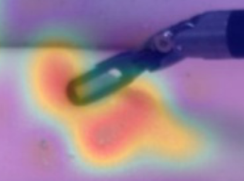
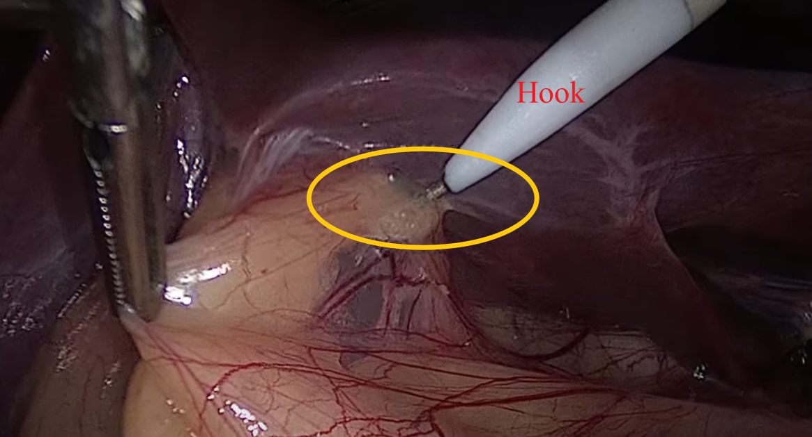
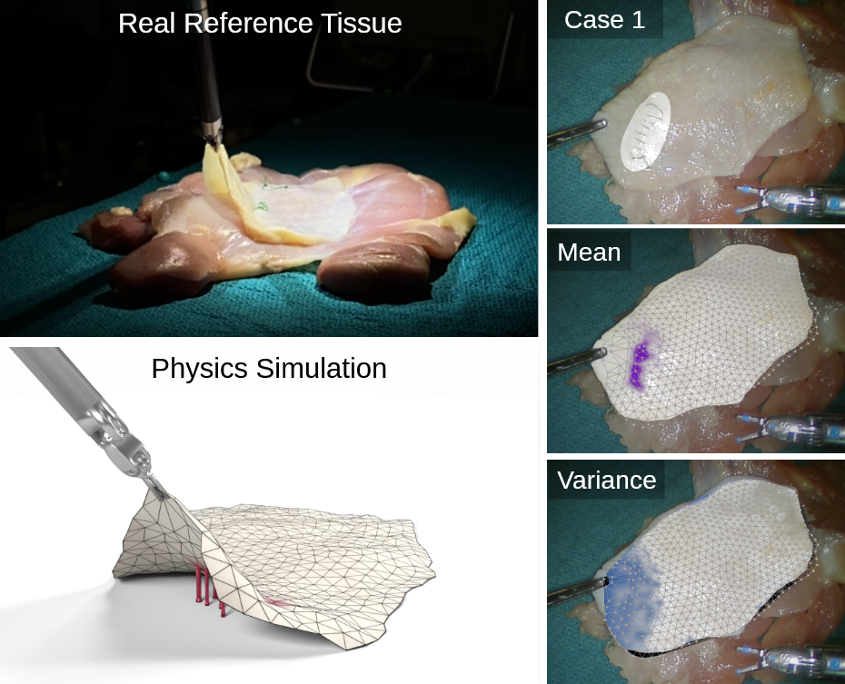

# Manipulation relationship identification based on monocular visual deformation field

### This idea involves voxel transfer within the full frame range of a continuous image frame of a single camera. Another description is the deformation field within the entire field of view. It doesn't matter. We can gradually understand what it is. In short, this passage is to introduce to you a kind of perceptual information source that I think has great application potential.

## Source of idea

In laparoscopic surgery, often only one lens extends into the surgical area, and there are no other sensors (power-off sensors, radars, contact buttons) besides that. 

So how do surgeons perceive the situation of the area to be operated on? In addition to their prior surgical experience, they attempted to touch the tissues, observe their deformations, and conduct depth positioning, mechanical property analysis, boundary parameter analysis, etc. During this process, the surgical instruments are the objects controlled by the doctor. Their appearance in the laparoscope is completely in line with the doctor's operational intuition, that is, they always move along with the operation. And doctors further help perceive information from the transfer relationship between the image of the instrument and the image of the tissue. More specific examples:

* Two-dimensional images have no depth information. To locate the depth distance of the tissue, the doctor slowly penetrates the instrument until deformation occurs at the junction of the instrument and the tissue in the image, that is, the instrument sinks into the tissue. Then it can be determined that the depth at the end of the instrument at this moment is the depth of the tissue.

* The electric hook is used to burn separated tissues. After the doctor operates the electric hook to hook the tissue, they will step on the electric pedal. Then, the part of the tissue that has been hooked will be damaged by the hot electric hook. So how do doctors determine if an organization has been hooked? Obviously, they observed whether the tissue near the electrohook in the two-dimensional image moved along with the electrohook. If the movement is completely synchronized, that is precisely the part held by the electric hook. If it is partially synchronized, then it might be a transitional part. If it has nothing to do with the movement of the electric hook at all, then it must not have been involved.

* We mentioned the boundary parameter earlier. What is it? Let's understand it with the work of UCSD:

Shinde, Nikhil Uday, et al. "Jiggle: An active sensing framework for boundary parameters estimation in deformable surgical environments." arXiv preprint arXiv:2405.09743 (2024).  
Simply, boundary parameters refer to whether two or more organizations are adhered to each other, or exactly where and to what extent they are connected. Its significance in surgery is not only to discover the position to be cut, but also to achieve more flexible and efficient operation. For example, in cholecystectomy, doctors often do not use two instruments to separate the liver and the gallbladder respectively. Instead, they only need one instrument to separate the gallbladder and push it backward. This is that after clarifying the boundary parameters between the liver and the gallbladder, one operation is sufficient to fix the two organs.

## How to do?

This section demonstrates how to obtain the monocular visual deformation field. The following original snippet is from the Comprehensive Robotic Cholecystectomy Dataset (CRCD).

The feature tracking model is used to track the dense feature points within the frame. We tried the effect of cotracker3 (https://github.com/facebookresearch/co-tracker). It can be understood in the form of optical flow, that is, tracking the movement of each voxel point. Several tracked points together constitute the deformation field. Or let's not introduce the concept of the field, but just take a look at how these discrete points move. Obviously, some points come from a rigid body, while some points on the tissue move randomly in a small range until the instrument comes into contact with the tissue.

After that, we also combined the monocular depth estimation model Metric3D (https://github.com/YvanYin/Metric3D) to obtain the depth value of each feature point being tracked (this step is not necessary. We only introduced a rough depth estimation to verify the calibration effect of this method in depth estimation). From this, we can obtain a 3 (2) -dimensional point cloud sequence. Subsequently, a graph can be constructed, and the motion relationship of each node is the key to revealing all the above-mentioned perceptual objects.

To specifically target valuable information, we attempt to incorporate an image segmentation model, adding a mask to the objects we need to manipulate and perceive. In this way, fewer feature points are tracked, it runs faster and is more focused.

## What can be used for?

If time permits, I really hope to create a new folder to explain my application concepts one by one. The movement relationship between each voxel we were just discussing can definitely enhance the cognitive level of robot operation.

Here are a few research points simply listed. I believe it is far more wonderful than these.

* How to sense tissue depth during laparoscopic surgery? The contact is judged by the movement relationship of the feature points, thereby obtaining the absolute depth of the contact point tissue. Combined with the depth estimation model, the estimation calibration is completed using the depth of discrete contact points. During the operation, contacts occur frequently. Each contact is utilized to dynamically adjust the depth estimate to achieve a more accurate estimation. Or, let robots touch tissues on their own......

* How did Jackie Chan do it?

People can often directly use a tool they have never met before. Besides the accumulated prior experience, the movement relationship of various parts of the tool during the operation process is also crucial. We can always clarify the working mode of the tool components after trying to operate them a few times. If robots can do it too, does it mean that they can quickly become familiar with various tools and achieve a breakthrough in universality......